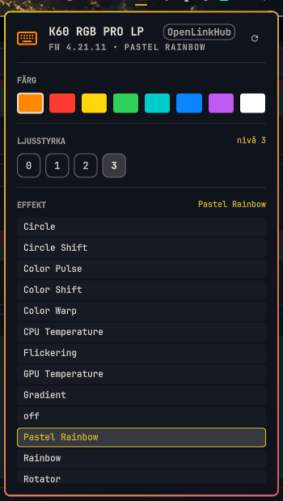

# Keyglow

Corsair keyboard lighting from the Omarchy bar. Colour, brightness and RGB effects
for a Corsair keyboard, applied through [OpenLinkHub](https://openlinkhub.dev/).

The bar shows a keyboard glyph in the colour you last applied. Click it for a panel
with colour swatches, a 0–3 brightness step, every RGB effect the keyboard knows,
a **follow-the-theme** toggle, and a link to the full OpenLinkHub dashboard (per-key
colours, macros, key remapping).



## Requirements

- **Omarchy** (the Quattro shell — this is a shell plugin, not a standalone app)
- **OpenLinkHub running as a service** and reachable on `127.0.0.1:27003`
- A Corsair keyboard OpenLinkHub supports. Built and measured on a
  **K60 RGB PRO LP** (`1b1c:1bad`, firmware 4.21.11)

The plugin never opens `/dev/hidraw` itself and needs no root: OpenLinkHub already
owns the keyboard, and the widget talks to its HTTP API.

### Installing OpenLinkHub (the dependency)

Arch and Omarchy, from the AUR:

```bash
yay -S openlinkhub-bin
sudo systemctl enable --now openlinkhub
```

OpenLinkHub's dashboard is then at <http://127.0.0.1:27003>, and its log lives in
`/var/lib/openlinkhub/stdout.log` — the line you want is
`Device successfully initialized`, naming your keyboard. Check the service with:

```bash
systemctl is-active openlinkhub
```

If the service cannot open the keyboard, its own log says so
(`Failed to open a device with path '/dev/hidrawN': Permission denied`). That is
OpenLinkHub's udev rule being compiled before its `openlinkhub` user exists; the fix
is `sudo systemctl restart systemd-udevd`.

## Install the plugin

```bash
omarchy plugin add https://github.com/alexwest1981/keyglow.git --enable
```

It lands in the right section of the bar. Move it where you want it:

```bash
omarchy bar move io.github.alexwest1981.keyglow --section right --index 5
```

## Remove the plugin

```bash
omarchy plugin disable io.github.alexwest1981.keyglow
omarchy plugin remove io.github.alexwest1981.keyglow
```

Removing the plugin touches nothing else — OpenLinkHub and your keyboard profiles
stay as they are.

## What it does under the hood

Everything goes through OpenLinkHub's HTTP API on `127.0.0.1:27003`. Three calls
matter, and the order is the whole trick:

| Step | Call | Why |
|---|---|---|
| Define | `PUT /api/color/change` | stores the colour (profile `static`) or the effect's values |
| **Activate** | `POST /api/color/global {"profile": …}` | **this is what the render loop listens to** — the per-device call alone answers `success` and changes nothing on the keyboard |
| Save | `POST /api/keyboard/profile/save` | pins it, otherwise OpenLinkHub reloads the profile from disk and reverts the change within ~30 s |

Brightness is `POST /api/brightness {"deviceId": …, "brightness": 0-3}` — levels,
not percent.

## Following the theme

Omarchy lets a theme ship a `keyboard.rgb` file next to its `colors.toml` — one
RRGGBB colour, optionally with a leading `#`. The stock `tokyo-night` theme writes
`ff00ff`; a theme without the file is simply skipped. Turn following on with the
panel's colour row or directly:

```bash
python3 ~/.config/omarchy/plugins/io.github.alexwest1981.keyglow/corsair_ctl.py theme
python3 ~/.config/omarchy/plugins/io.github.alexwest1981.keyglow/corsair_ctl.py theme off
```

While it is on, the panel's regular status poll compares the theme file with the
colour it last applied and re-applies it when they differ, so switching theme moves
the keyboard with it. The file is read bounded and matched whole (32 bytes,
`#?RRGGBB`); anything else is ignored rather than guessed at.

### Effects get the theme's palette, not black

Three profiles ship a **black** start and end in OpenLinkHub's own store —
`gradient`, `colorwarp` and `watercolor` (measured). Applied literally they look
exactly like `off`: the keyboard goes dark while the effect is nominally running.
A colourless effect is therefore given the theme's palette instead: `accent` for the
start and `selection` for the end, read from the theme's `colors.toml`. `off` keeps
its black — there, dark is the point. An effect that carries real colours
(`circle`, `storm`, …) is left exactly as OpenLinkHub stores it.

## Provenance

Keyglow is written from scratch against OpenLinkHub's documented HTTP API. It borrows
no code from OpenLinkHub or from any other Corsair plugin: OpenLinkHub is a *runtime
dependency* — a separate GPL-3.0 service that owns the keyboard over `hidraw` and
answers on `127.0.0.1:27003` — and nothing of its source is copied, linked or vendored
here. The `keyboard.rgb` convention is Omarchy's own theme format (documented in
Omarchy's theming notes and used by its stock themes), not something this plugin
invented or borrowed.

## Limitations (measured, not guessed)

- **The colour cannot be read back from the hardware.** The panel shows what it last
  applied; there is no readable LED state anywhere in the stack.
- The activation call is OpenLinkHub's *global* one. With more than one device under
  OpenLinkHub, an effect change reaches all of them.
- While the software owns the lighting, the keyboard's own `FN` presets do nothing.
  That is expected, not a fault.

## If the keyboard stops responding

Symptom: **neither** the panel nor the keyboard's own `FN` keys change anything — the
lighting keeps playing its last effect. Both paths being dead means the *keyboard* has
wedged, not the plugin. Replugging the USB cable fixes it, and it can be done from a
terminal without getting up:

```bash
USB=$(grep -l 1bad /sys/bus/usb/devices/*/idProduct | xargs -n1 dirname | xargs -n1 basename | head -1)
echo -n "$USB" | sudo tee /sys/bus/usb/drivers/usb/unbind
sleep 3
echo -n "$USB" | sudo tee /sys/bus/usb/drivers/usb/bind
sudo systemctl restart openlinkhub
```

The keyboard is gone for about three seconds and comes back with new `hidraw` numbers.
After that it follows the panel again.

## License

MIT — see [LICENSE](LICENSE).
